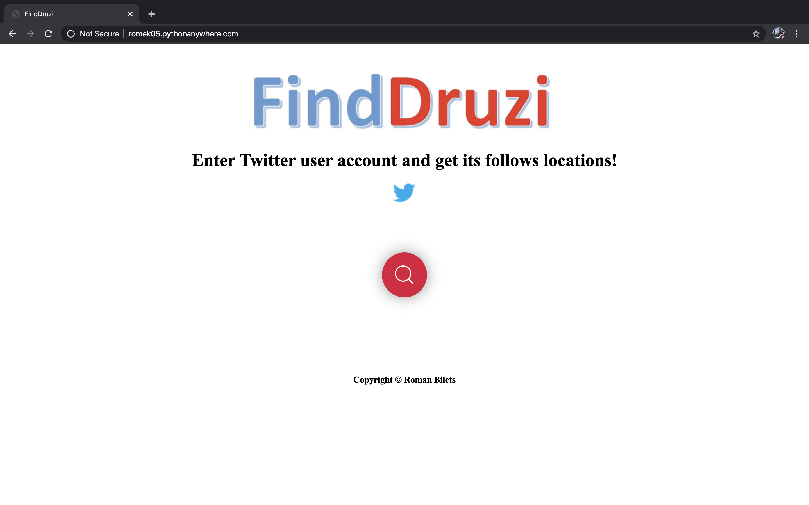
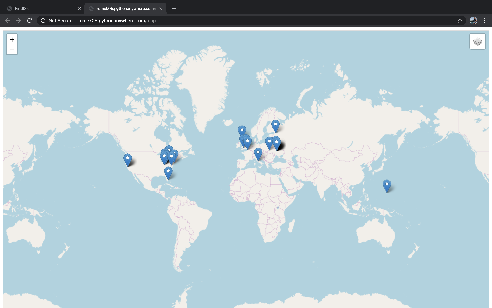

# FindDruzi

Web application to search for Twitter user's friends locations

## Getting Started

These instructions will get you started and running on your local machine. Enjoy my program!

### Prerequisites

In oder to start, you need to install following libraries on your local machine.

```
pip install flask
pip install geopy
pip install folium
```

### To run the program

A step by step guide to create your HTML map

```
Run the FindDruzi.py file.
Go to your local FindDruzi website.
Enter Twitter user's account name and press Enter.
Wait untill the map is generated.
Enjoy!
```


## Running the program
Search Web Page


Generated map after the user account was entered


### Summary

All in all, this Web application is a great way to find user's friends locations all over the world.

Enjoy the program!


## Authors

* **Roman Bilets** - *Initial work* - UCU IT&BA Student


## License

This project is licensed under the UCU License.

All rights reserved.


